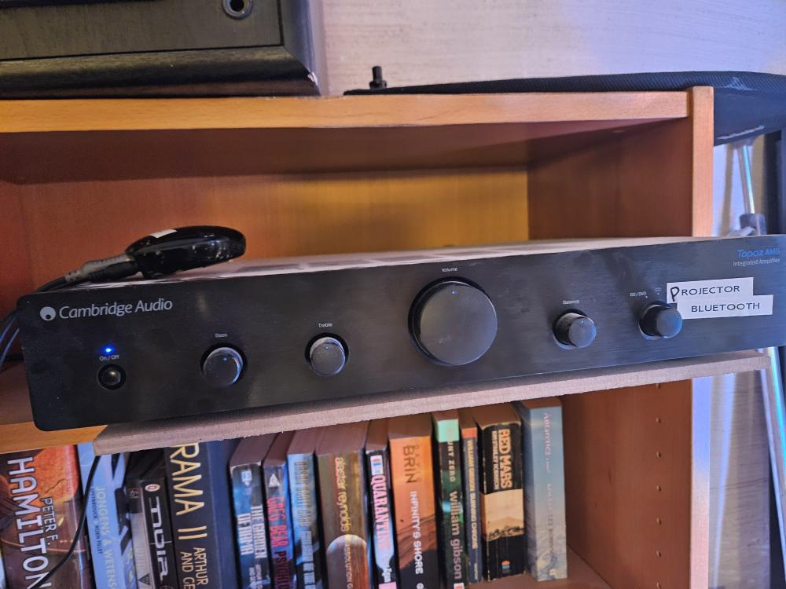
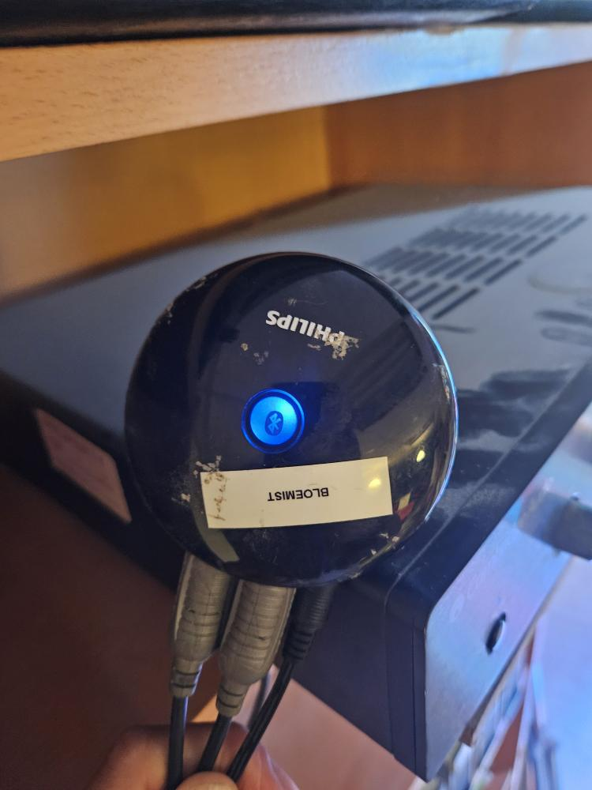

# Instructions for Connecting to the Bluetooth Speaker

Follow these steps to connect your device to the Bluetooth speaker setup. 

1. Turn on the Cambridge Audio amplifier.
2. Rotate the dial to Bluetooth input.  
3. Press the button on the Philips Bluetooth pairing device.  
4. Connect your device to "PhilipsBT".

  
  

