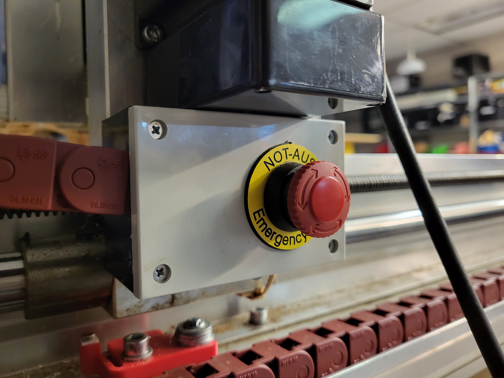
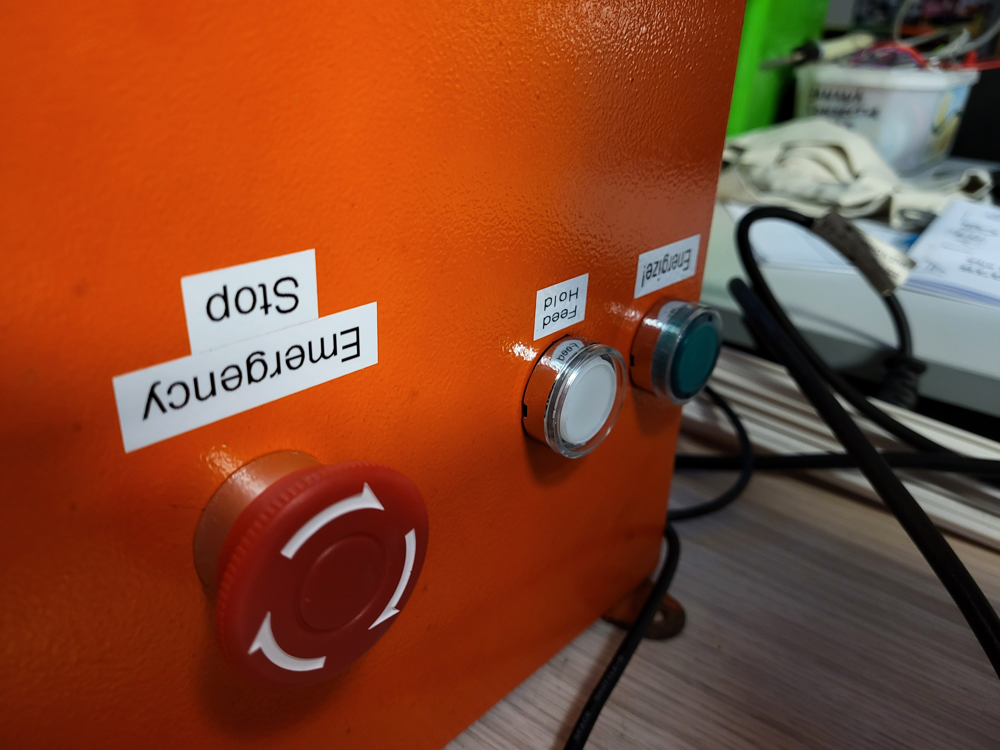
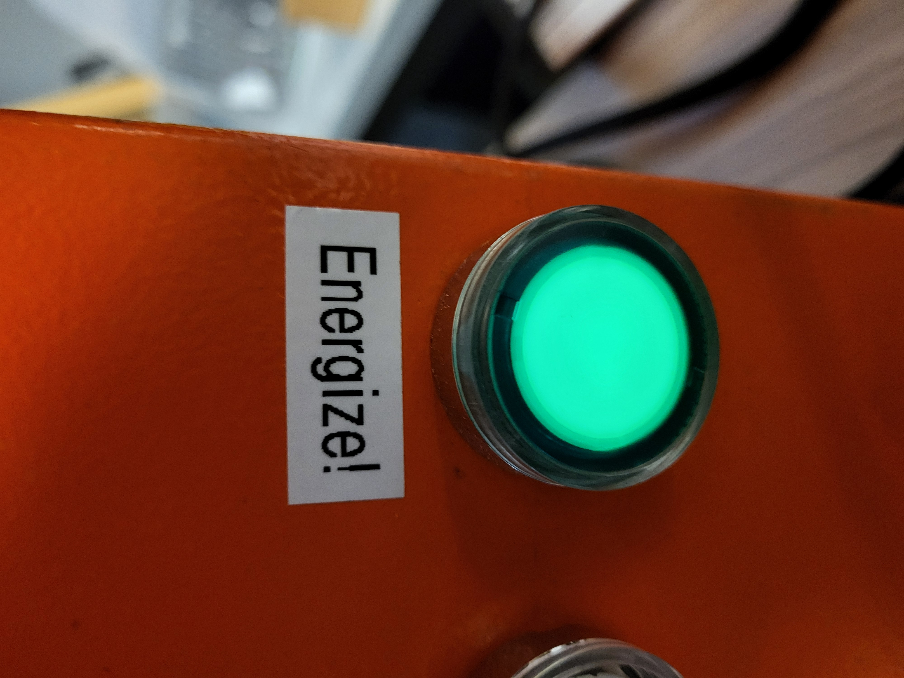
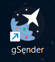
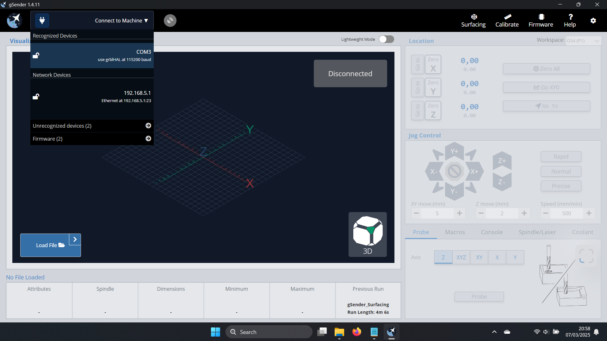
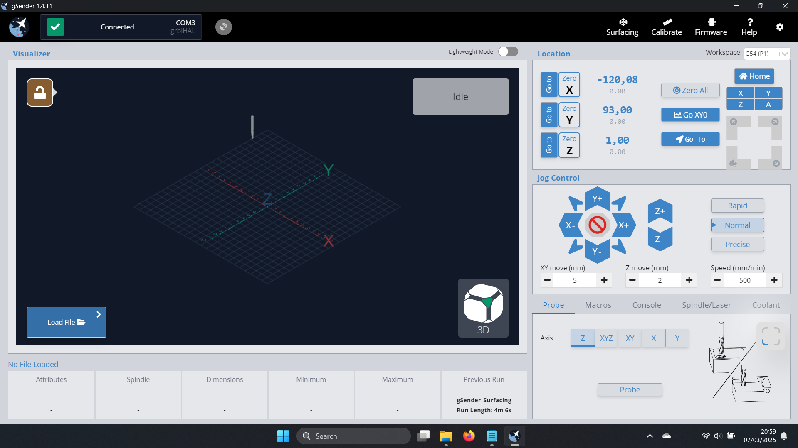
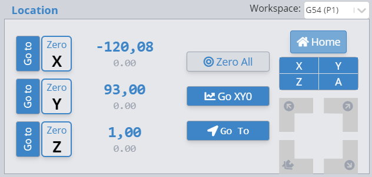

# CNC Machine

The space has a 3 axis CNC machine based on the High-Z S-720 from [CNC-STEP](https://www.cnc-step.com/high-z-s-720-cnc-router-720-x-420-x-110-mm-trapezium-screws/). To use the machine either 1T, Elvis, Teus or Sander should be present. 

# Safety
The machine has two E-stops (emergency stops). One is located on the x-axis gantry and another one on the electronics box. When pressed they cut the voltage to the spindle, motors and controller board. 
Extra informatino about implementation: It cuts off the controller board which also deprives the steppers of current. The spindle circuit is cut off using a seperate relay.  

When operating the machine:
- Don't go near the moving axis or spindle
- Always Wear earprotection
- Don't leave it unattended
- Stay attentive and be ready to hit the e-stop

# Getting Started Guide  

## Designing CNC Routines  

To start your CNC project, the first step is to design the part in CAD software like Fusion 360. Fusion 360 can also generate toolpaths for the CNC machine, but this is not an automatic process and is outside the scope of this document.  

For a very simple part, this 17-minute(!) video gives you an idea of how to get started: [Fusion 360 CAM Tutorial for Beginners! FF102](https://www.youtube.com/watch?v=Do_C_NLH5sw). 

If you get stuck, I (1T) and Evils can possibly help you get started.  

## Starting the machine 

Now that you have your routine you can start preparing the CNC machine. 

### Energizing the machine
- Plug in the machine
- Make sure both estops are not activated
- Press the green energize button on the electronics box

### Launch gcode sender 

Turn on the CNC laptop or CNC computer and launch **gsender**. Other options will work too but we found this option to be the easiest one to use. 

After launching gsender you should see the homescreen with a greyed-out button that says disconnected. 

Go to the top left, make sure the firmware is set to ``grblHAL`` and not ``grbl``, go to recognized devices and choose the USB option.

After this the greyed-out button should become green and say connected. You are now ready to start moving the machine. 

## Homing and moving the machine
- Always start by pressing the <button style="color: white; background: #356FA7; border: 1px solid grey; border-radius: 1px; padding: 6px 4px;">🏠 Home</button> button in the top right
- After that you can move the axises but keep in mind that nothing stops you from ramming the machine into the stock material. 

The machine will not stop itself from destroying itself so be careful!

## Running the routine (WIP)

Upload your routine and press start? 
Next time we do make a new part I'll take some screenshots. 

# Wiring 

Overview of wiring.

## Wiring at the gantry E-stop distribution box 
### 12-part cable
- 🔵 **Blue**: x1-limit switch
- 🟢 **Green**: x2-limit switch
- 💿 **Gray**: y-limit switch
- 🌸 **Pink**: z-limit switch 
- 🟡 **Yellow**: Ground
- 🧬 **Shielding**: Ground
- 🟤 **Brown**: c-limit switch
- 🔴🔵 **Red and Blue Striped**: E-stop button located on the gantry.
- 🟠💿 **Orange and Gray Striped**: E-stop button located on the gantry.
- 🔴 **Red**: Not Connected
- ⚫ **Black**: Not Connected
- 🟣 **Purple**: Not Connected
- ⚪ **White**: Not Connected
### 3-part cable for the x2 limit-switch 
- 🟢 **Green**: x2-limit switch
- ⚪ **White**: Ground
- 🟤 **Brown**: Not Connected
## Wiring at the DB9 ST-connector  

1) 🟤 **Brown**: c-limit switch  
2) 🔵 **Blue**: x1-limit switch  
3) 💿 **Gray**: y-limit switch  
4) 🌸 **Pink**: z-limit switch  
5) 🔴🔵 **Red and Blue Striped**: E-stop button located on the gantry.  
6) Not Connected  
7) 🟢 **Green**: x2-limit switch  
8) 🟠💿 **Orange and Gray Striped**: E-stop button located on the gantry.  
9) 🟡 **Yellow**: Ground  
10) 🧬 **Shielding**: Ground

## Out of date stuff? 

Do we need anything from here?
 
### Communication

You can connect to the controller over USB or using the network. 

## USB

1. Download putty
2. Choose "Session"
3. Select the checkbox for Serial.
4. Continue

Then it you will see the IP adress of the machine. At the moment it is ´´10.51.3.252´´

## Network 

1. Grab the IP using the USB method.
2. Go to the addres

**Settings**
Interface IP mode, default value driver dependent, set to 0 for static addres: ´´$3x1=0´´

