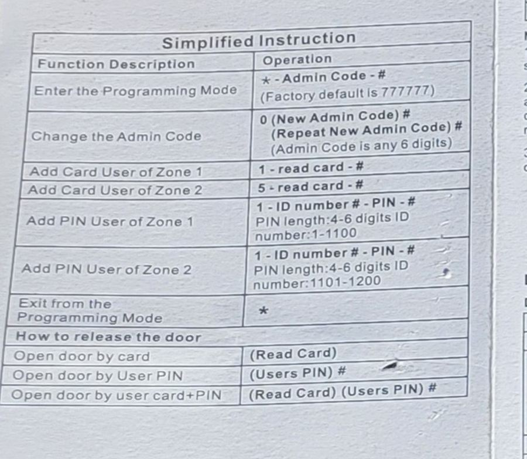

# Front gate (Stadsmakers terrain)

The front gate of the Stadsmakers terrain is controlled by a keypad with an RFID card reader. This page covers day-to-day use and how to manage PIN codes and cards.

## Opening the gate

| Method | What to do |
| --- | --- |
| Card | Hold your card against the reader |
| PIN | Enter your PIN, then press `#` |
| Card + PIN | Hold your card against the reader, enter your PIN, then press `#` |

## Programming mode (admin)

All configuration is done from programming mode on the keypad.

### Enter programming mode

Press `*` `(Admin Code)` `#`

The factory default admin code is `777777`.

### Change the admin code

While in programming mode:

Press `0` `(New Admin Code)` `#` `(Repeat New Admin Code)` `#`

The admin code must be exactly 6 digits.

### Add a PIN user

While in programming mode:

Press `1` `(ID number)` `#` `(PIN)` `#`

- PIN length: 4 to 6 digits
- ID number for Zone 1 users: `1` to `1100`
- ID number for Zone 2 users: `1101` to `1200`

Example: `1` `42` `#` `1234` `#` adds user ID 42 with PIN 1234.

### Add a card user

While in programming mode:

- Zone 1: press `1`, hold the card against the reader, then press `#`
- Zone 2: press `5`, hold the card against the reader, then press `#`

### Exit programming mode

Press `*`

## Reference

The "Simplified Instruction" section from the manufacturer's manual:

## Full manual

