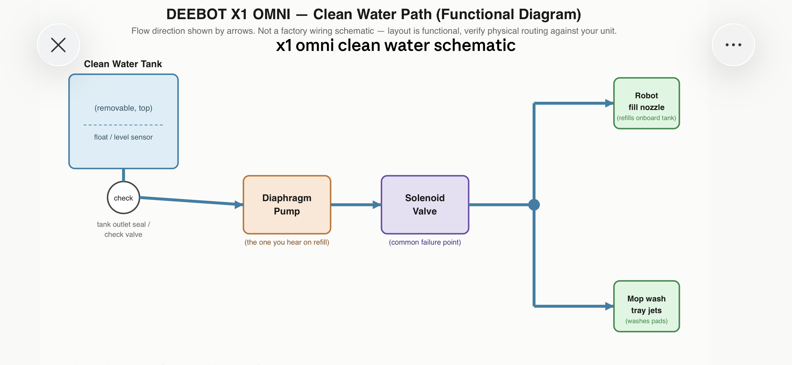
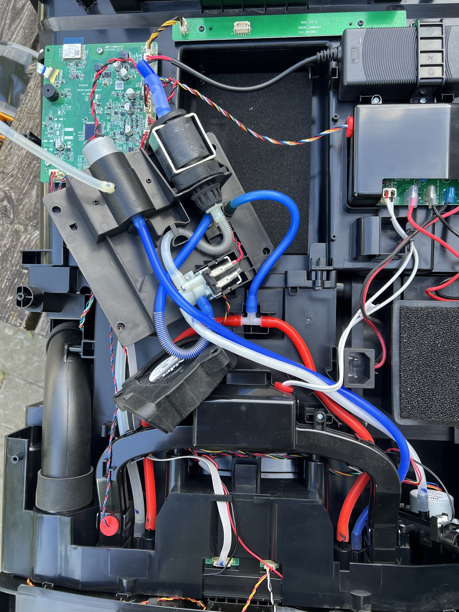
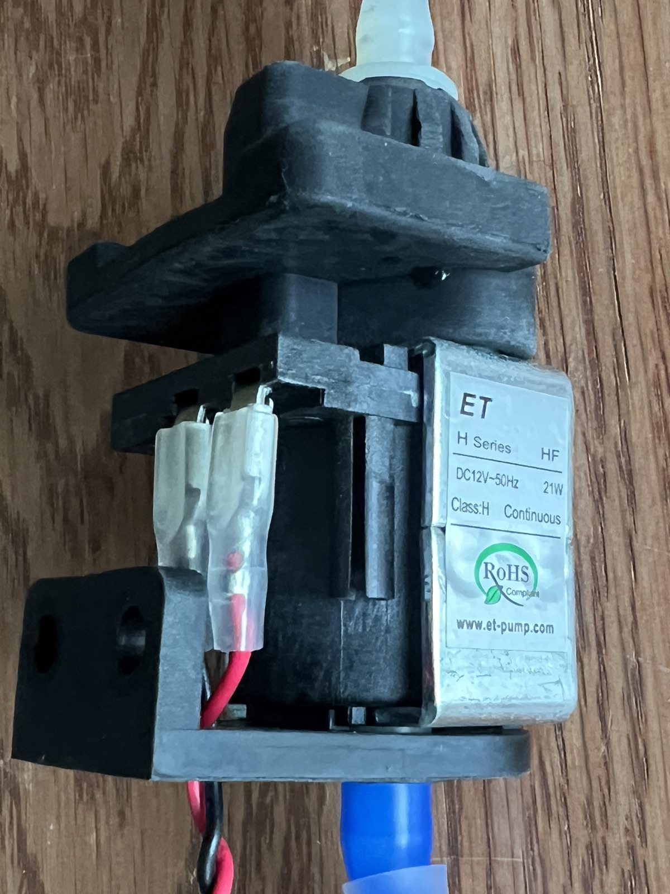

# Robot Vacuum

The space's robot vacuum is an Ecovacs Deebot X1 Omni.

To disassemble the device:

1. Unscrew the bottom plate
2. Remove the 2 side panels (slide them downwards)
3. Unscrew the so-called "dummy plug" from the back (2 screws) (note its orientation)
4. Unscrew the back panel --> see photo

The water functions are mounted together on a plastic plate. First remove the fan and the black plastic adhesive foil that holds the hoses in place. Then unscrew the 4 screws of the water assembly.

1. A solenoid water pump (12V 21W 50Hz AC). (It is easy to disassemble.) This pumps water out of the clean-water tank. See diagram. That water runs through the dummy plug, then through a 2-way valve that directs the water either to the tray at the bottom, or to the syringe that fills the robot (which has a tiny onboard water tank)
2. A small air pump that sucks air out of the dirty-water tank. This negative pressure empties the tray through the thick transparent hose.

2026-06-03: the clean water system stopped pumping. Johan disassembled the solenoid pump and found there was too much friction between the plunger and an o-ring. After injecting some silicone oil, the pump delivered its normal flow rate again. No idea how long this will last. If the issue comes back, it will be either a new o-ring or a new pump (see photo) from www.et-pump.com .

*clean water pump*
